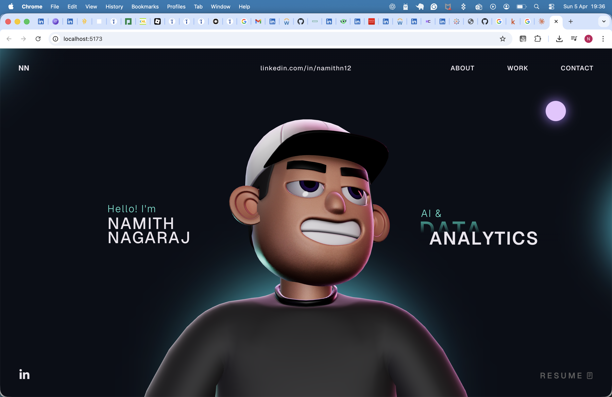

# Namith Nagaraj — Portfolio

Personal portfolio website built with React, TypeScript, Three.js, and GSAP. Features an interactive 3D character scene, scroll-driven animations, a physics-based tech stack display, and fully responsive section layout.

Live preview: [http://localhost:5173](http://localhost:5173) (run locally — see below)



---

## Table of Contents

- [Features](#features)
- [Tech Stack](#tech-stack)
- [Project Structure](#project-structure)
- [Getting Started](#getting-started)
- [Available Scripts](#available-scripts)
- [Deployment](#deployment)
- [Customization Guide](#customization-guide)
- [Troubleshooting](#troubleshooting)

---

## Features

- Interactive 3D character scene (Three.js + React Three Fiber) with mouse-tracking head rotation
- GSAP ScrollSmoother + ScrollTrigger scroll-driven animations
- Physics-based tech stack globe (Rapier physics, interactive balls)
- Sections: Landing, About, What I Do, Career & Education, Certifications, Work (coming soon), Tech Stack, Contact
- Custom animated cursor with context-aware states
- Animated loading screen with progress tracker
- Fully responsive — mobile, tablet, and desktop layouts
- Resume download button (PDF served from `/public`)

---

## Tech Stack

### Core

| Package | Version | Purpose |
|---|---|---|
| `react` | ^18.3.1 | UI framework |
| `react-dom` | ^18.3.1 | DOM rendering |
| `typescript` | ^5.5.3 | Type safety |
| `vite` | ^5.4.1 | Build tool and dev server |

### 3D & Animation

| Package | Version | Purpose |
|---|---|---|
| `three` | ^0.168.0 | 3D rendering engine |
| `@react-three/fiber` | ^8.17.10 | React renderer for Three.js |
| `@react-three/drei` | ^9.120.4 | Three.js helpers and abstractions |
| `@react-three/postprocessing` | ^2.16.3 | Post-processing effects (AO, bloom) |
| `@react-three/rapier` | ^1.5.0 | Physics simulation for tech spheres |
| `@react-three/cannon` | ^6.6.0 | Physics (secondary) |
| `@types/three` | ^0.168.0 | TypeScript types for Three.js |
| `gsap` | ^3.12.7 | Animation engine (ScrollTrigger, ScrollSmoother, SplitText) |
| `@gsap/react` | ^2.1.1 | React integration for GSAP |

### UI & Utilities

| Package | Version | Purpose |
|---|---|---|
| `react-icons` | ^5.3.0 | Icon library (MD, FA6, TB) |
| `react-fast-marquee` | ^1.6.5 | Scrolling text marquee (loading screen) |
| `three-stdlib` | ^2.33.0 | Three.js standard library extensions |
| `@vercel/analytics` | ^1.4.1 | Analytics (optional, safe to remove) |

### Dev Tools

| Package | Purpose |
|---|---|
| `eslint` + plugins | Linting |
| `@vitejs/plugin-react` | Vite React plugin |
| `typescript-eslint` | TypeScript-aware linting |

---

## Project Structure

```
.
├── public/
│   ├── draco/                        # Draco decoder (GLTF compression)
│   ├── images/                       # Tech stack logos and project screenshots
│   │   ├── python2.webp
│   │   ├── powerbi2.webp
│   │   ├── tableau2.webp
│   │   ├── sql2.webp
│   │   ├── aws2.webp
│   │   ├── snowflake2.webp
│   │   ├── excel2.webp
│   │   └── r2.webp
│   ├── models/
│   │   ├── character.enc             # Encrypted 3D character model (GLTF)
│   │   └── char_enviorment.hdr       # HDR environment map for lighting
│   └── Namith_Nagaraj_Resume.pdf     # Resume (served at /Namith_Nagaraj_Resume.pdf)
├── src/
│   ├── components/
│   │   ├── Character/                # 3D character scene and utilities
│   │   │   ├── Scene.tsx             # Main Three.js canvas setup
│   │   │   ├── index.tsx
│   │   │   └── utils/
│   │   │       ├── animationUtils.ts
│   │   │       ├── character.ts      # GLTF loader + decryption
│   │   │       ├── decrypt.ts        # AES-CBC file decryption
│   │   │       ├── lighting.ts
│   │   │       ├── mouseUtils.ts
│   │   │       └── resizeUtils.ts
│   │   ├── styles/                   # Per-component CSS modules
│   │   │   ├── About.css
│   │   │   ├── Career.css
│   │   │   ├── Certifications.css
│   │   │   ├── Contact.css
│   │   │   ├── Cursor.css
│   │   │   ├── Landing.css
│   │   │   ├── Loading.css
│   │   │   ├── Navbar.css
│   │   │   ├── SocialIcons.css
│   │   │   ├── WhatIDo.css
│   │   │   ├── Work.css
│   │   │   └── style.css
│   │   ├── utils/
│   │   │   ├── GsapScroll.ts         # GSAP scroll timelines
│   │   │   ├── initialFX.ts          # Initial page load animations
│   │   │   └── splitText.ts          # GSAP SplitText helper
│   │   ├── About.tsx
│   │   ├── Career.tsx                # Work experience + education
│   │   ├── Certifications.tsx        # Certifications grid
│   │   ├── Contact.tsx
│   │   ├── Cursor.tsx
│   │   ├── HoverLinks.tsx
│   │   ├── Landing.tsx
│   │   ├── Loading.tsx
│   │   ├── MainContainer.tsx         # Page layout and section composition
│   │   ├── Navbar.tsx                # Nav + GSAP ScrollSmoother init
│   │   ├── SocialIcons.tsx           # LinkedIn + Resume button
│   │   ├── TechStack.tsx             # Physics sphere simulation
│   │   ├── WhatIDo.tsx               # Skills accordion
│   │   ├── Work.tsx                  # Projects carousel (coming soon)
│   │   └── WorkImage.tsx
│   ├── context/
│   │   └── LoadingProvider.tsx       # Global loading state
│   ├── data/
│   │   └── boneData.ts
│   ├── types/
│   │   └── gsap-splittext.d.ts
│   ├── App.tsx
│   ├── App.css
│   ├── index.css
│   ├── main.tsx
│   └── vite-env.d.ts
├── .gitignore
├── eslint.config.js
├── index.html
├── package.json
├── tsconfig.json
├── tsconfig.app.json
├── tsconfig.node.json
└── vite.config.ts
```

---

## Getting Started

### Prerequisites

- **Node.js** 18 or later ([nodejs.org](https://nodejs.org))
- **npm** 9 or later (included with Node.js)

### Installation

```bash
# 1. Clone the repo
git clone https://github.com/namithn1/portfolio.git
cd portfolio

# 2. Install all dependencies
npm install

# 3. Start the development server
npm run dev
```

Open [http://localhost:5173](http://localhost:5173) in your browser.

> **Note:** The 3D character model loads over the network on first visit. Allow a few seconds for the loading screen to complete.

---

## Available Scripts

| Command | Description |
|---|---|
| `npm run dev` | Start Vite dev server (exposes host for local network) |
| `npm run build` | Type-check and build production bundle to `dist/` |
| `npm run preview` | Serve the `dist/` build locally for verification |
| `npm run lint` | Run ESLint across all source files |

---

## Deployment

This site can be deployed to any static hosting provider. The output is a standard Vite `dist/` folder.

### Vercel (recommended — zero config)

1. Push to GitHub
2. Import the repo at [vercel.com/new](https://vercel.com/new)
3. Vercel auto-detects Vite — no config needed
4. Deploy

### Netlify

1. Push to GitHub
2. Connect repo at [app.netlify.com](https://app.netlify.com)
3. Set build command: `npm run build`
4. Set publish directory: `dist`
5. Deploy

### Cloudflare Pages

1. Connect repo in Cloudflare Dashboard → Pages
2. Build command: `npm run build`
3. Build output directory: `dist`
4. Deploy

### Manual / Self-hosted

```bash
npm run build          # generates dist/
npm run preview        # test locally at http://localhost:4173
# then upload dist/ to any static host or CDN
```

---

## Customization Guide

### Personal content

| File | What to update |
|---|---|
| [src/components/Landing.tsx](src/components/Landing.tsx) | Name and role title |
| [src/components/About.tsx](src/components/About.tsx) | Professional summary |
| [src/components/Career.tsx](src/components/Career.tsx) | Work experience and education |
| [src/components/WhatIDo.tsx](src/components/WhatIDo.tsx) | Skills and specializations |
| [src/components/Certifications.tsx](src/components/Certifications.tsx) | Certifications list |
| [src/components/Work.tsx](src/components/Work.tsx) | Projects carousel |
| [src/components/Contact.tsx](src/components/Contact.tsx) | Email and social links |
| [src/components/Navbar.tsx](src/components/Navbar.tsx) | Monogram and LinkedIn URL |
| [src/components/SocialIcons.tsx](src/components/SocialIcons.tsx) | Social links and resume href |
| [src/components/Loading.tsx](src/components/Loading.tsx) | Monogram and marquee text |
| [index.html](index.html) | Browser tab title |

### Tech stack logos

Add or replace images in `public/images/` and update the `imageUrls` array in [src/components/TechStack.tsx](src/components/TechStack.tsx). Images should be square PNGs (128×128px recommended).

### Resume

Replace `public/Namith_Nagaraj_Resume.pdf` with your own PDF. The resume button in `SocialIcons.tsx` links to `/Namith_Nagaraj_Resume.pdf`.

### Adding projects (Work section)

Edit [src/components/Work.tsx](src/components/Work.tsx) — add entries to the `projects` array with `title`, `category`, `tools`, `image`, and `link` fields.

---

## Troubleshooting

**Blank screen on load**
Run `npm install` to ensure all dependencies are present. Check the browser console for import errors.

**3D model not appearing**
The character model is loaded and decrypted at runtime. Ensure you have a stable internet connection on first load. Check the browser console for network errors.

**GSAP SplitText / ScrollSmoother errors**
These plugins are included in the standard GSAP package (v3.12+). Make sure you are not mixing `gsap` and `gsap-trial` packages.

**TypeScript build errors**
Run `npm run build` and fix any type errors reported before deploying.

**Large bundle warning**
The Three.js + physics engine chunk (~2.5MB) exceeds Vite's default warning threshold. This is expected and does not affect runtime performance — assets are chunked and lazy-loaded.
